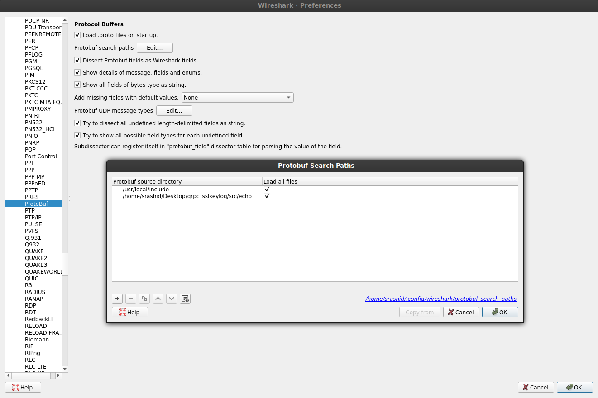
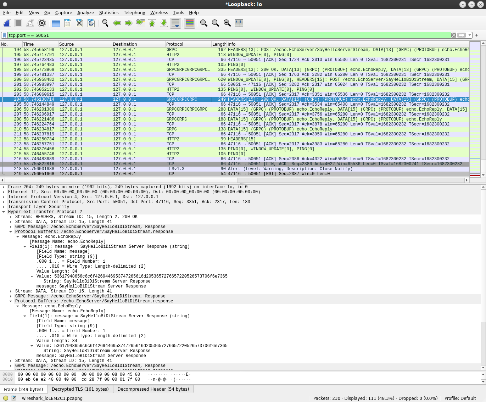

## Using Wireshark to decrypt TLS gRPC Client-Server protobuf messages

Sample client server in golang that demonstrates how to decode protobuf messages for a gRPC Client->Server over TLS.

This is nothing new and is described here in wireshark's documentation ([How to Export TLS Master keys of gRPC](https://gitlab.com/wireshark/wireshark/-/wikis/How-to-Export-TLS-Master-keys-of-gRPC))

What drove me to write this sample was a co-woker who as interested in viewing gRPC protbuf message _in java_ for Google Cloud Pubsub.

Since i earlier worked on similar stuff in other repos like

* [gRPC with cURL](https://github.com/salrashid123/grpc_curl#tcptraces-for-request-and-response-grpc-calls)
* [OpenSSL 3.0.0 docker with TLS trace enabled (enable-ssl-trace) and FIPS](https://github.com/salrashid123/openssl_trace#tls-decryption-with-wireshark)


i figured i'd give it a shot....fast forward, while i could decrypt the pubsub TLS traffic, wasn't able to get the correct `.proto` Google Cloud uses to properly parse inside wireshark's dissectors.

I'm not sure what the issue with wireshark is but i suspect its a mismatch of the proto version or annotations google added in.

Anyway, what this repo does show is a very simple go-based client/server gRPC system that does unary, client streaming, server streaming and full bidi.  All along the tls traffic is seen by wireshark, decrypted and after that, parsed using the `.proto` files


Lets get started

## Sample gRPC Client/Server

First thing is to setup the client server and wireshark.

For wireshark, we will save the TLS encryption keys to `/tmp/keylog.log`.  This file contains the TLS keys in  [NSS Key Log Format](https://developer.mozilla.org/en-US/docs/Mozilla/Projects/NSS/Key_Log_Format) which golang can output and wireshark can consume.

First tell wireshark where to find it


Now we need to tell whreshark how to decode the proto after TLS is done.  For that, we will configure wireshark to look at `src/echo/echo.proto`




Now we're ready to start the gRPC Server

```bash
# optionally, if you really want to compile from source...
# protoc --go_out=. --go_opt=paths=source_relative --go-grpc_opt=require_unimplemented_servers=false --go-grpc_out=. --go-grpc_opt=paths=source_relative src/echo/echo.proto

  go run src/grpc_server.go \
    --grpcport 0.0.0.0:50051 \
    --tlsCert=certs/grpc_server_crt.pem \
    --tlsKey=certs/grpc_server_key.pem
```

Now start wireshark.  In a new window run

```bash
sudo wireshark
```

Once you start wireshark, select the 'lo' (local interface)

Run the client but first tell it where to log the keys

```bash
export SSLKEYLOGFILE=/tmp/keylog.log

  go run src/grpc_client.go \
    --host 127.0.0.1:50051 \
    --tlsCert=certs/CA_crt.pem \
    --servername=grpc.domain.com
```

Note, to use go, you need to first ask it to dump the keylog per [crypto.tls.Config.KeyLogWriter](https://pkg.go.dev/crypto/tls#Config.KeyLogWriter).  Please take careful note of the dangers described there...

The output of the various modes

#### Unary


#### Client Streaming


#### Server Streaming


#### BiDi Streaming

`client->server`:


`server->client`:




note the `Stream ID 15` is used in both paths

I've also left a sample keylog and wireshark file for you to load and test decoding

## google PubSub

Ok, so now we're back to what i really wanted to do...decode PubSub. 

As mentioned, i was unsuccessful (partially)...i could decrypt but not decode

I think it should be something like this


```bash
# first get all the protos
git clone https://github.com/googleapis/googleapis.git
git clone https://github.com/protocolbuffers/protobuf.git
```

Then tell wireshark to load the proto files  << this is the point where i'm stuck.  Wireshark keeps complaining about annotations that appear as syntax errors..

Anyway, if you ran the grpc client in this repo, and prior to that set the `SSLKEYLOGFILE` parameter, you should be able to see the pubsub traffic if you use the following
filter in wireshark:

```
tcp.port == 443 and tls.handshake.extensions_server_name=="pubsub.googleapis.com"
```

However, even if you cant' see the traffic, you can still see the bytes...presumably, you can dump the `DATA` to a file from wireshark, then use go to read each payload as protoMessage


---

### JAVA

I tried to use [jSSLKeyLog](https://jsslkeylog.github.io/) with Cloud PubSub in Java and while it did dump the keys to a file, I wasn't able to use wireshark to decrypt the data

I've left off as far as i got with that here in he repo

YMMV

```bash
# run standalone
mvn clean install exec:java

# create fatjar
mvn clean package

# or as package
java -jar target/TestApp-1.0-SNAPSHOT-jar-with-dependencies.jar
```

